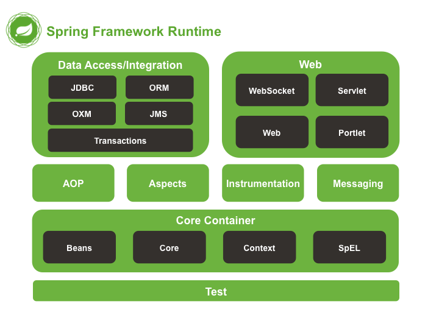

<ctb markdown=1>Spring boot</ctb>
- Là một framework của **Java** nhằm phát triển một hệ quản lý object cũng như triển khai các mô hình website

# Table of contents
[1. Kiến trúc](#1-kiến-trúc) <br>
[2. IOC container](#2-ioc-container)<br>
[3. Beans](3-#Beans)<br>
	[3.1. Định nghĩa](#3-1-định-nghĩa)<br>
	[3.2. Vòng đời của beans](#3-2-vòng-đời)<br>
[4. Profiles](#4-profiles)<br>
[5. Tiêm phụ thuộc](#5-tiêm-phụ-thuộc)<br>
[6. Autowired](#6-autowired)<br>
[7. JDBC](#7-jdbc)<br>
[8. Quản lý giao dịch](#8-quản-lý-giao-dịch)<br>
[9. Spring với rest api](#9-rest-api)<br>
[10. Spring MVC](#10-spring-mvc)<br>

# 1. Kiến trúc
- **Spring framework** có kiến trúc được mô tả trong hình bên dưới, với thành phần cốt lõi  là **Container Core**.


<span>Hình 1: Kiến trúc của Spring framework</span>

<explain markdown=1>
<p markdown=1>Trong đó, kiến trúc của <b markdown=1>Spring framework bao gồm:</b>
<ul markdown=1>
<li><b markdown=1>Core container:</b> bao gồm các module <i markdown=1>spring-core, spring beans, spring context, springcontext-support </i> và <i markdown=1>spring-expression</i>:
<ul markdown=1>
<li>Module <b markdown=1>spring-core</b> và <b markdown=1>spring-beans</b> cung cấp những phần cơ bản cho <i markdown=1>framework</i> bao gồm: <i markdown=1><b markdown=1>Dependency Injection và IoC </b></i>
<li>Module <b markdown=1>spring-context</b> xây dựng trên một nền tảng vững chắc được cung cấp bởi <b markdown=1>spring-core và spring-beans</b>, được sử dụng để truy cập vào các đối tượng trong framework-style tương tự như việc đăng kí một JNDI.  <b markdown=1>spring-context-support</b> giúp cho việc tích hợp ứng dụng bên thử ba vào trong ứng dụng như caching, mailing, schedule, ... 
<li><b markdown=1>Spring expression</b> cung cấp một <b markdown=1>Expression Language</b> mạnh mẽ cho việc truy cập và tính toán đồ thị đối tượng trong runtime được kế thừa từ <i markdown=1>unified expression language</i>. Ngôn ngữ này hỗ trợ setting và getting giá trị các property, gọi phương thức, truy cập vào nội dung của mảng, tập hợp và chỉ mục, toán tử logic và tính toán, đặt tên biến, và truy xuất các đối tượng theo tên từ IoC Container của Spring.
</ul>
<li><b markdown=1>Data Access/Integration</b>: bao gồm các module <i markdown=1>JDBC, ORM, OXM, JMS, Transcations</i> trong đó:
<ul markdown=1>
<li><b markdown=1>spring-jdbc</b> cung cấp một lớp JDBC-abstraction để loại bỏ những code tẻ nhạt. Cả JDBC và phân tích những mã lỗi cụ thể của database-vendor.
<li><b markdown=1>spring-orm</b> cung cấp lớp tích hợp với các orm API phổ biến như <i markdown=1><b markdown=1>JPA, JDO, Hibernate</b></i>.
<li><b markdown=1>spring-oxm</b> cung cấp lớp abstaction hỗ trợ triển khai Object/XMLmapping như AXB,  Castor, XMLBeans, JiBX và XStream.
<li><b markdown=1>spring-jms</b> chứa các tính năng tạo và sử dụng các message. Từ Spring Framework 4.1, nó đã được tích hợp spring-messaging.
<li><b markdown=1>spring-transaction</b> hỗ trợ quản lý giao dịch theo chương trình và khai báo cho các lớp mà thực hiện các giao diện đặc biệt và cho tất cả POJO của bạn.
</ul>
<li><b markdown=1>WEB</b>: bao gồm các module <i markdown=1>spring-web, spring-webmvc, spring-websocket, springwebmvc-porlet</i>. Trong đó:
<ul markdown=1>
<li><b markdown=1>spring-web</b> cung cấp các tính năng tích hợp web theo những chức năng theo hướng cơ bản như tải tập tin lên nhiều phần dữ liệu và khởi tạo các container IoC sử dụng nghe servlet và một bối cảnh ứng dụng web theo định hướng.
<li><b markdown=1>spring-webmvc</b> bao gồm việc triển khai Model-View-Controller (MVC) của Spring cho ứng dụng web.
<li><b markdown=1>spring-websocket</b> cung cấp hỗ trợ cho Websocket-based, giao tiếp hai chiều giữa client và server trong các ứng dụng web.
<li><b markdown=1>springwebmvc-portlet</b> cung cấp việc triển khai MVC được sử dụng trong môi trường portlet và ánh xạ chức năng của module Web-Servlet. 
</ul>
<li>Những module khác bao gồm:
<ul markdown=1>
<li>Module <b markdown=1>AOP</b> cung cấp một thực hiện lập trình hướng khía cạnh cho phép bạn xác định phương pháp-chặn và pointcuts để sạch tách mã thực hiện chức năng đó nên được tách ra.
<li>Module <b markdown=1>Aspects</b> cung cấp tích hợp với AspectJ, mà lại là một khuôn khổ AOP mạnh mẽ và trưởng thành.
<li>Module <b markdown=1>Instrumentation</b> cung cấp thiết bị đo đạc lớp hỗ trợ và triển khai lớp bộ nạp được sử dụng trong các máy chủ ứng dụng 
nhất định.
<li>Module <kp markdown=1>Messaging</kp> cung cấp hỗ trợ cho STOMP như WebSocket sub-protocol để sử dụng trong các ứng dụng. Nó cũng hỗ trợ một mô hình lập trình chú thích cho việc định tuyến và xử lý tin nhắn STOMP từ các máy khách WebSocket.
<li>Module <b markdown=1>Test</b> hỗ trợ việc kiểm tra các thành phần Spring với JUnit hoặc TestNG khuôn khổ. </ul>
</ul>
</p>
</explain>

[:arrow_up:back](#table-of-contents)
# 2. ioc container
- **IOC** là một nguyên lý lập trình được thiết kế để đảo ngược qui trình điều khiển của `object` dựa trên một `object` khác. IoC bao gồm ba hướng triển khai:
	- Dependencies Injection
	- Service Locator
	- Events
## Dependencies Injection

- Trong  khai báo thông thường, khi muốn tham chiếu/gọi một đối tượng được thực hiện bằng hàm contructor và gọi đối tượng đó một cách trực tiếp:
```
public class Cat{
	private Hair hair;
	public Cat(){
		this.hair = new Hair();
	}
}
```
- Với kiểu khai báo như trên, trong trường hợp ta thay đổi `object` **Hair** (thêm một đối số chẳng hạn), thì lúc này ta buộc phải thay đổi giá trị của biến **hair** được khởi tạo bên trong hàm `constructor` của `object` **Cat**. Dòng code trên sẽ được thay đổi như sau.

[a](#a)
```java
public class Cat{
	private Hair hair;
	public Cat(){
		# blue là màu sắc của Hair, hay là đối số của Hair. 
		this.hair = new Hair("blue");
	}
}
```
- Khi có sự thay đổi sẽ dẫn đến thay đổi bên trong nội tại dòng code. Về lâu dài khi dự án phình to ra, sẽ gây bất tiện cho quá trình truyền biến. Khi đó khái niệm **Dependencies Injection** được sử dụng để đề cập đến đoạn code bên dưới:

**Dependencies Injection :arrow_down:**
```java
public class Cat{
    private Hair hair;
    public Cat(Hair hair){
        # blue là màu sắc của Hair, hay là đối số của Hair. 
        this.hair = hair;
    }
}
```

## Inversion of control (đảo ngược điều khiển)
- Như đã đề cập ở trên, việc sử dụng **Dependencies  Injection** giúp đảo ngược hành động điều khiển của **class** phụ thuộc nó. Quay lại với ví dụ ở trên trong hai  `class` **Cat** và **Hair**:
	<explain markdown=1>
	<p markdown=1>
	<ul markdown=1>
	<li>Khi sử dụng <code markdown=1>constructor</code> mà không sử dụng cùng với <b markdown=1>Dependencies Injection</b> thì khi này <code markdown=1>class</code> <b markdown=1>Cat</b> sẽ phụ thuộc vào <b markdown=1>Hair</b>. Điều này sẽ dẫn đến việc khi dòng code của <b markdown=1>Hair</b> thay đổi (như đã đề cập từ trước), thì <b markdown=1>Cat</b> cũng sẽ thay đổi theo do sự phụ thuộc của <code markdown=1>class</code> này với <b markdown=1></b> <b markdown=1>Hair</b>.
	<li>Ngược lại, khi sử dụng <code markdown=1>constructor</code>  cùng với <b markdown=1>Dependencies Injection</b> thì <code markdown=1>class</code> <b markdown=1> Hair</b> sẽ phụ thuộc vào <b markdown=1>Cat</b>. Khi này sẽ được gọi là <b markdown=1>Inversion of control</b> (đảo ngược điều khiển).
	</ul>
	</p>
	</explain>
[:arrow_up:back](#table-of-contents)
